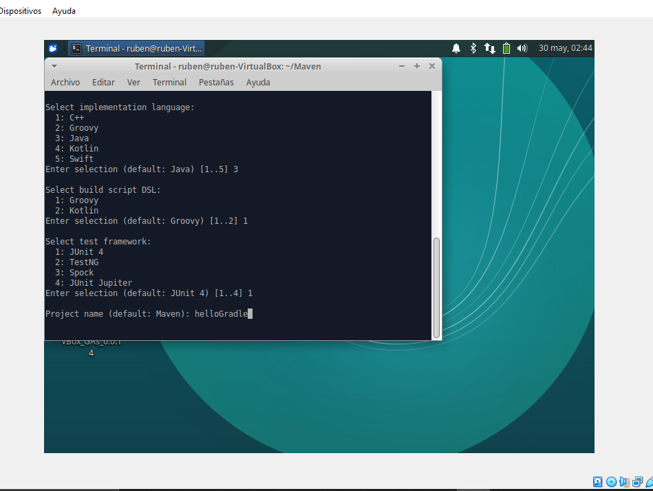

# Instal·lació de Gradle 

- Anem a instalarlo en Ubuntu, mitjansant commandos:

Primer farem un update per a actualitzar:

```
sudo apt-get update
```

- Y seguidament procedirem a instalar-lo.

```
sudo apt-get install gradle
```

- Acontinuació, ficarem _"gradle --version"_ per comprobar en quina versio estem. En el nostre cas estarem a la versió 5.1.

# Exemple de Gradle 

- El primer que deurem de fer es crear una carpeta per al projecte, dins de eixa caroeta ejecutarem la terminal.

- Una vegada estem en la terminal deurem de ficar el comando _"gradle init"_.

- En la primera opcio ens poden eixir o 4 o 8 possibles numeros, en el nostre cas ens ha ic¡xit 4 y deurem de ficar el numero que ens diga _application_, si ens ixqueren 8 ens posaria una opcio on digera _"java-application"_.

- Una vegada elegit deurem seguir la imatge:



# Creació del projecte amb una sola ordre

- El primer que deurem de fer es crear el directori y accedir a ell:

```
mkdir helloGradle
...
cd helloGradle
```

- Una vegada estem dins tornarem a llancar _"gradle init"_, pero esta vegada sera diferent a la de abans en aquesta sera aixina:

Project-name = al nom del nostre projecte.
Package = on es situa.

```
gradle init    --type java-application \
               --test-framework junit \
               --dsl groovy \
               --project-name helloGradle \
               --package Gradle\

```

### Estructura del projecte

- Ara anem a comprobar la estructura del projecte mitjansant l'ordre _"tree"_:

```
.
|-- build.gradle
|-- gradle
|    `-- wrapper
|        |-- gradle-wrapper.jar
|        `-- gradle-wrapper.properties
|-- gradlew
|-- gradlew.bat
|-- settings.gradle
|-- src
|   |-- main
|   |   |-- java
|   |   |   `-- Gradle
|   |   |       `-- App.java
|   |   `-- resources
|   `-- test
|       |-- java
|       |   `-- Gradle
|       |       `-- AppTest.java
|       `-- resources
`-- wrapper
    |-- gradle-wrapper.jar
    `-- gradle-wrapper.properties
```

- Si volgerem esborrar els fitxers de aquesta carpeta simplement deuriem de ficar el comando _"rm -r src/test"_.

- Si anem al arxiu de _App.data_, veureim que si funciona ens deuria de ejecutar un "Hello World".

- Ara aniriem a modificar el projecet _build.gradle_, on deuriem esborrar els comentaris per veure millor el codic.

```
plugins {
     id 'java'
     id 'application'
     }
repositories {
    jcenter()
}

dependencies {
    implementation 'com.google.guava:guava:26.0-jre'
    testImplementation 'junit:junit:4.12'
}

mainClassName = 'Gradle.App'
```

### Construcció i execució del projecte

- Per a poder construirlo deurem de ejecutar desde la carpeta principal del projecte:  _"gradle build"_.

- Y si fem lo de abans en deuria de ixir aso:

```
build
|-- classes
|    `-- java
|        `-- main
|            `-- Gradle
|                 `-- App.class
|-- distributions
|   |-- helloGradle.tar
|   `-- helloGradle.zip
|-- libs
|   `-- helloGradle.jar
|-- scripts
|   |-- helloGradle
|   `-- helloGradle.bat
`-- tmp
    |-- compileJava
    `-- jar
        `-- MANIFEST.MF
```

- Per a veure les diferents fasses de la contrucció: _gradle build -i_.

- Si volem tornar a fer el projecte: _gradle clean_.

- Per a finalitzar ejecutem gradle, per vure si ens mostra el nostre "Hello World":

```
gradle run

> Task :run
Hello world.

BUILD SUCCESSFUL in 2s
2 actionable tasks: 1 executed, 1 up-to-date
```


# Afegint dependències

- En el nostre cas anem a instalar la llibreria de _Math_, per pooder fer calculs...

- Lo que deurem de fer primer es buscar en el navegador "Apache Commons Math", y en mostrara una pagina on ens dira quina versio volem en el nostre cas hem elegit la ultima, y ens mostrara diferents formats en el nostre cas elegirem Gradle on ens mostrara una codic (el copiem).

- De aquesta froma:


- El seguent pas sera anaar al nostre fitxer _build.gradle_ y añadirem baix de *"jcenter"*: _"mavenCentral()"_ y tame tindrem que añadir el codic de abans en la seccio de dependencies. Amb aso tindrem instalat ya la llibreria de math.

- De esta forma podem añadir cualsevol llibreria.